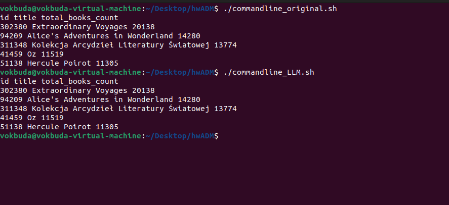

# ADM-HW2
- Folder AWSQ(related to AWSQ question) contains script start.py
- Folder CLQ(related to CLQ question) contains scripts: commanline_LLM.sh and commandline_original.sh
- File main.ipynb contains all other exercises besides two above
### CLQ(command line question)
#### Below you can see execution of commandline_original.sh and commandline_LLM.sh
- The file which had been used in script is called "series.json"
- Below you can see 
